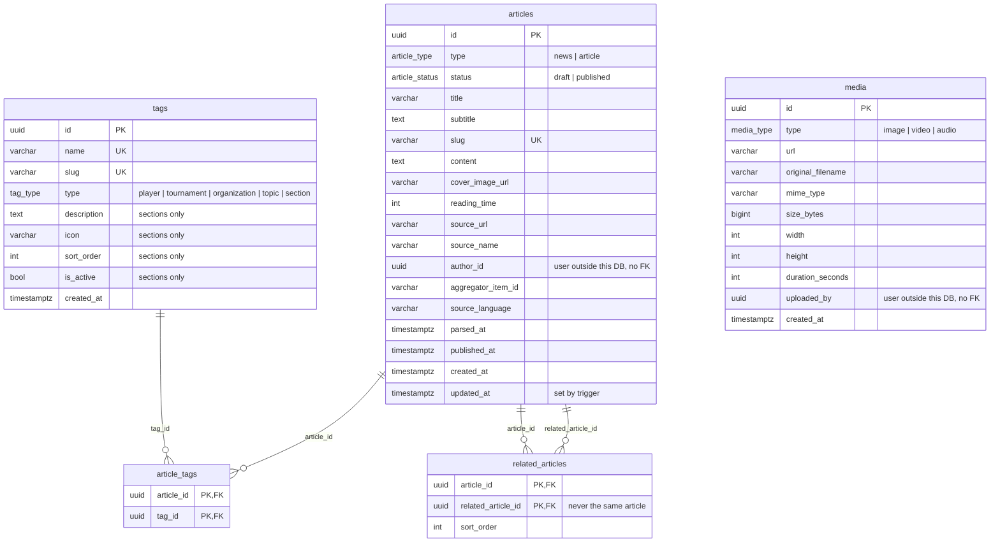

# Content DB - ER diagram

Schema: `content-service/src/main/resources/db/changelog/migrations/001__initial-schema.sql`

`media` is a standalone file registry: no table references it by FK, and
`articles.cover_image_url` is a plain URL. The junction tables cascade on
delete from both sides.
