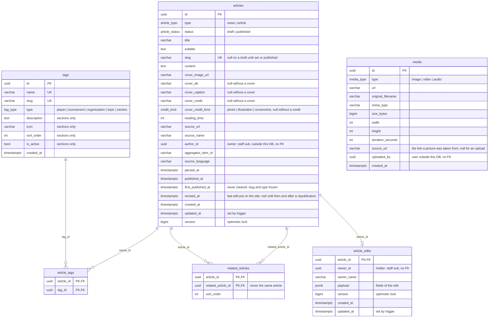

# Content DB - ER diagram

Schema: `content-service/src/main/resources/db/changelog/migrations/001__initial-schema.sql`

```mermaid
erDiagram
    articles ||--o{ article_tags : "article_id"
    tags ||--o{ article_tags : "tag_id"
    articles ||--o{ related_articles : "article_id"
    articles ||--o{ related_articles : "related_article_id"
    articles ||--o| article_edits : "article_id"

    articles {
        uuid id PK
        article_type type "news | article"
        article_status status "draft | published"
        varchar title
        text subtitle
        varchar slug UK "null on a draft until set or published"
        text content
        varchar cover_image_url
        varchar cover_alt "null without a cover"
        varchar cover_caption "null without a cover"
        varchar cover_credit "null without a cover"
        credit_kind cover_credit_kind "photo | illustration | screenshot, null without a credit"
        int reading_time
        varchar source_url
        varchar source_name
        uuid author_id "owner: staff sub, outside this DB, no FK"
        varchar aggregator_item_id
        varchar source_language
        timestamptz parsed_at
        timestamptz published_at
        timestamptz first_published_at "never cleared: slug and type frozen"
        timestamptz revised_at "last edit put on the site; null until then and after a republication"
        timestamptz created_at
        timestamptz updated_at "set by trigger"
        bigint version "optimistic lock"
    }

    article_edits {
        uuid article_id PK, FK
        uuid owner_id "holder: staff sub, no FK"
        varchar owner_name
        jsonb payload "fields of the edit"
        bigint version "optimistic lock"
        timestamptz created_at
        timestamptz updated_at "set by trigger"
    }

    tags {
        uuid id PK
        varchar name UK
        varchar slug UK
        tag_type type "player | tournament | organization | topic | section"
        text description "sections only"
        varchar icon "sections only"
        int sort_order "sections only"
        bool is_active "sections only"
        timestamptz created_at
    }

    article_tags {
        uuid article_id PK, FK
        uuid tag_id PK, FK
    }

    related_articles {
        uuid article_id PK, FK
        uuid related_article_id PK, FK "never the same article"
        int sort_order
    }

    media {
        uuid id PK
        media_type type "image | video | audio"
        varchar url
        varchar original_filename
        varchar mime_type
        bigint size_bytes
        int width
        int height
        int duration_seconds
        varchar source_url "the link a picture was taken from; null for an upload"
        uuid uploaded_by "user outside this DB, no FK"
        timestamptz created_at
    }
```

`article_edits` holds the pending edit of a published article: saved, not on the
site yet, at most one per article. Its holder is the only one who may edit the
article until the edit is applied or dropped. See `../editorial.md`.

`media` is a standalone file registry: no table references it by FK, and
`articles.cover_image_url` is a plain URL. The junction tables cascade on
delete from both sides.

The cover's text (`cover_alt`, `cover_caption`, `cover_credit`) is optional part by
part and kept only while there is a cover. `cover_credit_kind` names what the
credit is; the word before it ("Фото", "Иллюстрация", "Скриншот") is the site's.
Pictures in the text carry the same parts inside `content`, see `../editorial.md`.
