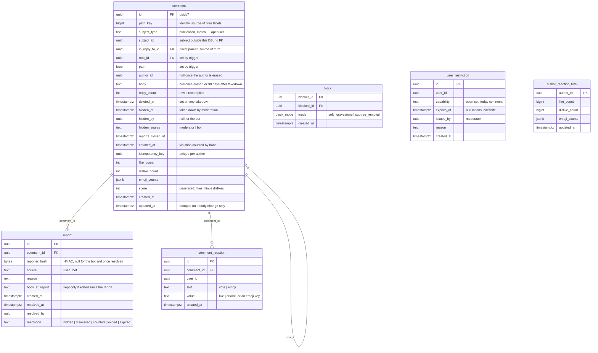

# Discussion DB - ER diagram

Schema: `discussion-service/src/main/resources/db/changelog/migrations/001__initial-schema.sql`

`comment` is an adjacency list: `in_reply_to_id` is the source of truth,
`path` and `root_id` are derived from it by a trigger on insert; a root
comment has no parent and is its own root. User ids (`author_id`, `user_id`,
`blocker_id`, `blocked_id`, `issued_by`, `hidden_by`, `resolved_by`) and
`subject_id` point outside this database and carry no FK. `report` and
`comment_reaction` cascade on delete from `comment`; `author_reaction_total`
keeps what an author collected on comments no longer shown.
