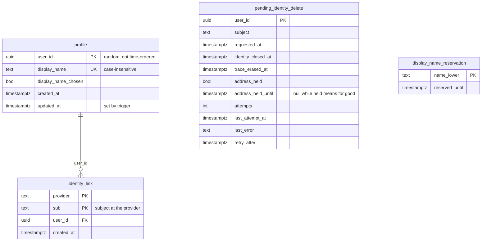

# User DB - ER diagram

Schema: `user-service/src/main/resources/db/changelog/migrations/001__initial-schema.sql`

`identity_link` is the only FK, cascading on delete from `profile`.
`pending_identity_delete` and `display_name_reservation` outlive the profile
row on purpose and reference nothing: the first carries an erasure through
to the end, the second keeps a departed reader's name out of circulation.
A trigger on `profile` refuses a name that is still reserved.
